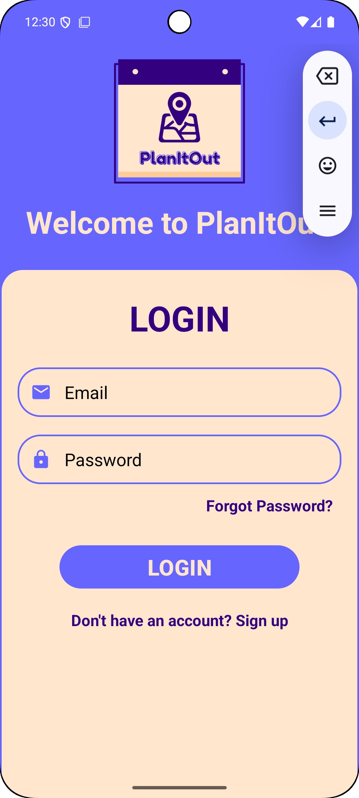
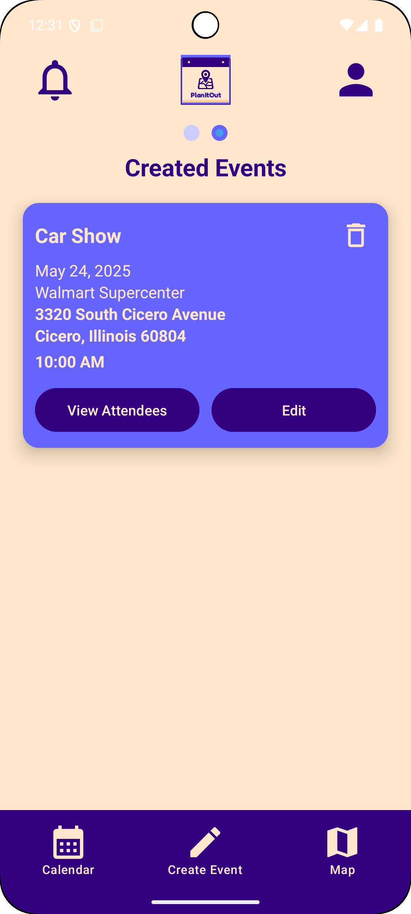
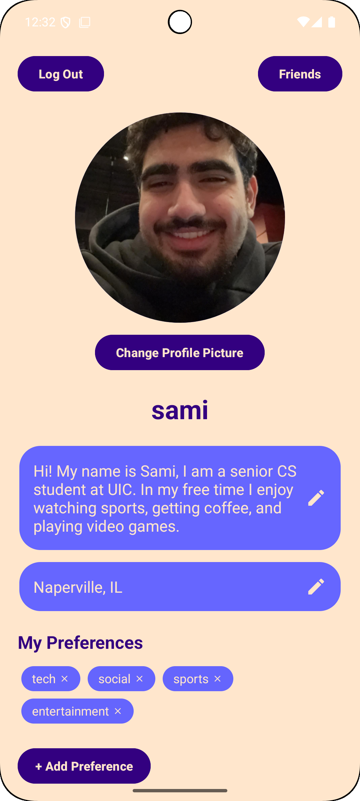

# PlanItOut

PlanItOut is an Android application developed as a group project. The app helps users discover public and private events, receive personalized event recommendations, and plan their schedules effectively using Google Maps and Firebase integration.

## Features

- Discover public and private events
- Personalized event recommendations
- Integrated Google Maps for location-based event discovery
- Firebase Firestore and Realtime Database support
- User authentication
- Interactive calendar with event views

## Tech Stack

- Java
- Android SDK
- Firebase (Auth, Firestore, Realtime DB, Storage, Analytics)
- Google Maps SDK
- Kizitonwose CalendarView
- Retrofit2

## Developers

- [Sami Abushamat](https://github.com/samiabushamat)  
- [Muhammad Taha](https://github.com/MuhdTaha)  
- [Daron Jones](https://github.com/djones59)  
- [Mriza Baig](https://github.com/mbaig66uic)

## Setup

1. Clone the repository:
   ```bash
   git clone https://github.com/samiabushamat/PlanItOut.git
   
<h2 align="center">📸 App Screenshots</h2>

<div align="center" style="display: flex; justify-content: center; gap: 20px; flex-wrap: wrap;">

  
  
  

</div>

<br/>

<h2 align="center">🎥 Demo Video</h2>

<p align="center">
  <video width="400" controls>
    <source src="app/assets/Demo.mp4" type="video/mp4">
    Your browser does not support the video tag.  
    <a href="app/assets/Demo.mp4">Click here to view the video</a>
  </video>
</p>


